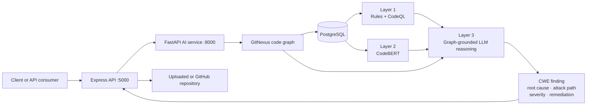

# AICP Backend & AI Security Scanner

AICP is a repository-aware application security scanner that combines deterministic static analysis, a fine-tuned CodeBERT classifier, and graph-grounded LLM reasoning. This repository contains the backend and AI services extracted from the original [AICP project](https://github.com/ifindnemo/ai-pctp).

The scanner indexes source repositories with GitNexus, synchronizes code graph nodes and relationships to PostgreSQL, and uses that graph to explain vulnerabilities across files. Findings include CWE mappings, root causes, attack paths, severity, impact, and remediation guidance. Secrets are masked before source context is sent to an LLM.

## Highlights

- Three-stage security analysis pipeline
  - Layer 1: 83 regex-based rules plus CodeQL integration
  - Layer 2: batched CodeBERT binary classification of functions
  - Layer 3: LLM/CrewAI reasoning grounded in repository graph context
- GitNexus repository parsing and graph traversal
- PostgreSQL persistence for code nodes, relationships, and sync runs
- FastAPI endpoints for repository indexing, graph queries, and full scans
- Express API for authentication, repository upload/GitHub import, scan orchestration, progress tracking, patch generation, and external threat-intelligence integrations
- CWE dictionary with structured weakness metadata
- Secret masking before LLM calls
- Benchmark and ablation scripts for CodeBERT, GraphRAG, and the end-to-end pipeline
- Docker Compose setup for FastAPI, GitNexus, and the Express backend

## Architecture



### Analysis pipeline

1. GitNexus parses a repository into files, functions, classes, methods, and relations such as `CALLS`, `IMPORTS`, and `DEFINES`.
2. The graph is normalized and synchronized to PostgreSQL.
3. Layer 1 applies deterministic security rules and can merge CodeQL results.
4. Layer 2 runs the local CodeBERT sequence-classification checkpoint over function bodies in batches.
5. Layer 3 retrieves graph context, masks secrets, evaluates CWE candidates, and produces an explainable result.

## Repository layout

```text
.
├── app/                         # FastAPI application and AI pipeline
│   ├── core/                    # Database, GitNexus HTTP/CLI clients, settings
│   ├── prompts/                 # Structured Layer 3 prompts
│   ├── router/                  # FastAPI graph and scan endpoints
│   ├── schema/                  # Pydantic request/response and DB models
│   ├── service/                 # Scan layers, CodeQL, GitNexus sync, LLM tools
│   └── tests/                   # Unit and integration-oriented tests
├── server/                      # Express orchestration and application API
│   ├── controllers/             # Scan workflow
│   ├── models/                  # MongoDB models
│   └── utils/                   # CVE search, mail, counters
├── scripts/                     # Benchmarks and production pipeline runners
├── cwe_dictionary.json          # CWE candidates used by Layer 3
├── Dockerfile                   # FastAPI/AI image
├── docker-compose.yml           # GitNexus + FastAPI + Express stack
└── requirements.txt             # Python dependencies
```

## Requirements

- Python 3.12 recommended
- Node.js 22 recommended
- PostgreSQL or Supabase PostgreSQL
- MongoDB for user/authentication features in the Express API
- GitNexus CLI, installed automatically by the Python Docker image
- CodeQL CLI for Layer 1 CodeQL analysis
- An OpenAI-compatible LLM API key
- A local fine-tuned CodeBERT checkpoint

The FastAPI service can run independently if the Express application features are not needed.

## Model checkpoint

GitHub rejects ordinary Git objects larger than 100 MB, so `model.safetensors` is intentionally excluded from source control. Put the fine-tuned checkpoint at:

```text
app/service/codebert-binary-final_v69_/model.safetensors
```

Alternatively, point `SCAN_MODEL_PATH` to another Hugging Face-compatible sequence-classification checkpoint. The directory must contain the model weights and configuration files. The included configuration expects binary labels: `SAFE` and `VULNERABLE`.

## Configuration

Copy the example environment file and fill in only the services you use:

```bash
cp .env.example .env
```

Core AI service variables:

| Variable | Purpose |
| --- | --- |
| `DATABASE_URL` | PostgreSQL connection string; takes precedence over individual Supabase fields |
| `SUPABASE_DB_*` | Alternative PostgreSQL connection settings |
| `OPENAI_API_KEY` | Credential for the OpenAI-compatible LLM endpoint |
| `OPENAI_BASE_URL` | LLM API base URL |
| `OPENAI_MODEL` | Model used by Layer 3 |
| `GITNEXUS_SERVE_BASE_URL` | GitNexus HTTP server address |
| `SCAN_MODEL_PATH` | Local CodeBERT checkpoint directory |
| `CWE_DICTIONARY_PATH` | Path to the CWE JSON dictionary |
| `REPO_UPLOADS_DIR` | Directory shared by upload, indexing, and scan services |

Express API variables are documented in [`server/.env.example`](server/.env.example). Never commit `.env`, model prompts containing source code, scan results containing secrets, or uploaded repositories.

## Quick start with Docker

1. Create `.env` from `.env.example` and configure PostgreSQL, MongoDB, and the LLM API.
2. Place the CodeBERT weights in the model directory described above.
3. Start the stack:

```bash
docker compose up --build
```

Services:

| Service | URL |
| --- | --- |
| Express backend | `http://localhost:5000` |
| FastAPI AI service | `http://localhost:8000` |
| FastAPI Swagger UI | `http://localhost:8000/docs` |
| GitNexus HTTP server | `http://localhost:4747` |

Check service health:

```bash
curl http://localhost:8000/health
curl http://localhost:8000/gitnexus/server/ready
```

## Local development

### FastAPI and AI service

```bash
python -m venv .venv
source .venv/bin/activate
pip install -r requirements.txt
npx -y gitnexus@latest serve --host 127.0.0.1 --port 4747
uvicorn app.main:app --reload --port 8000
```

On Windows PowerShell, activate the environment with:

```powershell
.\.venv\Scripts\Activate.ps1
```

### Express backend

```bash
cd server
cp .env.example .env
npm ci
npm start
```

Set `PYTHON_API_URL=http://localhost:8000` when both services run locally.

## API workflow

### 1. Index and synchronize a repository

The repository path must be visible to both GitNexus and FastAPI. In Docker, place it under the shared `server/temp_uploads` volume.

```bash
curl -X POST http://localhost:8000/gitnexus/analyze \
  -H "Content-Type: application/json" \
  -d '{
    "repo_path": "/app/temp_uploads/example-repo",
    "force": false,
    "include_content": true,
    "replace_repo": true
  }'
```

`include_content` must be enabled for CodeBERT inference because Layer 2 reads function bodies from synchronized graph nodes.

### 2. Run all three scan layers

```bash
curl -X POST http://localhost:8000/scan/layers \
  -H "Content-Type: application/json" \
  -d '{
    "repo_name": "example-repo",
    "repo_root": "/app/temp_uploads/example-repo",
    "layer3_limit": 0,
    "depth": 2,
    "debug_prompt": false
  }'
```

### 3. Query graph context

```bash
curl "http://localhost:8000/gitnexus/db/node-graph?repo_name=example-repo&node_id=File:src/app.py&depth=2&same_file=false"
```

Important FastAPI routes:

| Method | Route | Description |
| --- | --- | --- |
| `GET` | `/health` | API health check |
| `POST` | `/gitnexus/analyze` | Analyze a repository and sync its graph |
| `GET` | `/gitnexus/status` | GitNexus index status |
| `GET` | `/gitnexus/repos` | List indexed repositories |
| `GET` | `/gitnexus/db/node-graph` | Retrieve bounded graph context |
| `POST` | `/gitnexus/parse-full-graph` | Return a filtered repository graph |
| `POST` | `/scan/layers` | Run rule, CodeBERT, and LLM layers |

The Express service adds application-level endpoints under `/api`, including authenticated upload, GitHub import, scan progress, graph exploration, explanation, and patch generation.

## CLI scan

After indexing and syncing the target repository, the combined pipeline can also be run directly:

```bash
python -m app.service.ScanLayers \
  --repo-name example-repo \
  --repo-root /path/to/example-repo \
  --depth 2 \
  --layer3-limit 0 \
  --output scan_output.json
```

## Tests and evaluation

Run Python tests:

```bash
python -m unittest discover -s app/tests -v
```

Some GitNexus and LLM tests are integration tests and require their corresponding services and credentials. Benchmark utilities in `scripts/` cover:

- CodeBERT repository and PrimeVul evaluation
- GraphRAG ablation
- Layer 3 end-to-end ablation
- Full AICP pipeline comparison
- Repository baseline comparison against external analyzers

Generated benchmark datasets and reports are deliberately excluded from this backend-focused repository.

## Security notes

- Source snippets and scanner evidence are passed through secret masking before LLM analysis.
- `.env`, uploaded repositories, prompt dumps, generated scan outputs, databases, and model weights are ignored by Git.
- Treat every detected credential as compromised until verified otherwise; rotate real keys before removing them from Git history.
- Use restricted database and LLM credentials in production.
- Review generated remediation and patches before applying them.
- Restrict CORS and add rate limiting before exposing either API publicly.

## Provenance and license

This repository is a backend/AI-focused extraction of the public [ifindnemo/ai-pctp](https://github.com/ifindnemo/ai-pctp) project. The FastAPI/AI implementation is sourced from `feats/layer3` at commit `a0576b0`, while the Express backend is sourced from `main` at commit `93910b2`.

Licensed under the MIT License. See [`LICENSE.txt`](LICENSE.txt).
